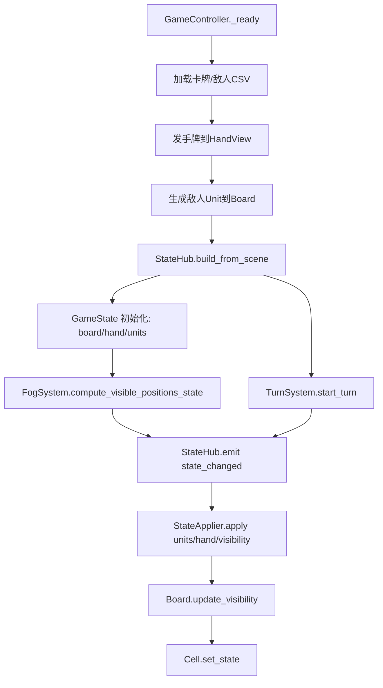
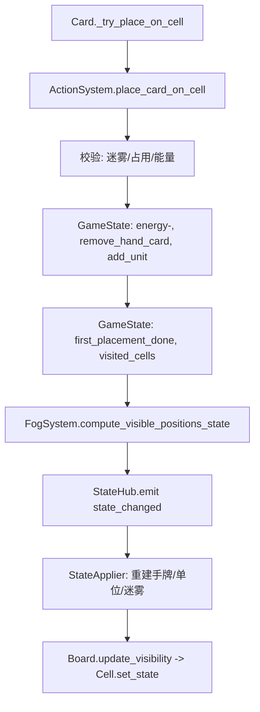
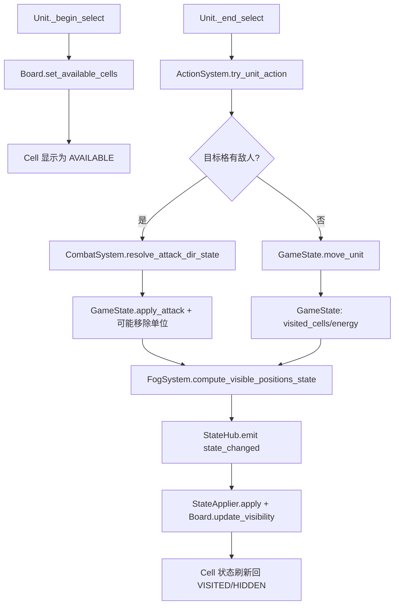

# 架构方案（重写）

目标：规则层可脱离 UI 运行；迷雾会阻止放置；易扩展 AI 与卡牌效果。

## 分层与职责
1) **Data（配置层）**
- 负责读 CSV/资源并缓存，不涉及游戏逻辑。
- 输出规范化数据：`CardDef`、`EnemyDef`、`EffectDef`。

2) **State（纯数据状态层）**
- 纯数据结构，表示游戏的当前快照。
- 不依赖场景树/节点；可序列化、可测试。

3) **Systems（规则系统层）**
- 读取 State + 输入 Action，产出新的 State + 事件。
- 规则、AI、效果都放在这里；可单元测试。

4) **Presentation（表现层）**
- 仅订阅 State 变化并渲染（手牌/棋盘/单位/迷雾）。
- 收集 UI 输入，转换为 Action 请求。

5) **Composition（装配层）**
- 组织依赖与生命周期：加载 Data、创建 State、挂载 Systems、绑定 View。

## 核心模块
### Data
- `CardDataRepo`：加载 `assets/cardinfos.csv` → `CardDef` 列表。
- `EnemyDataRepo`：加载 `assets/enemyinfos.csv` → `EnemyDef` 列表。
- `EffectCatalog`：卡牌/单位效果的注册表（可数据驱动）。

### State
- `GameState`
  - `TurnState`：回合号、资源（能量/翻牌）。
  - `BoardState`：格子坐标、可见性、占位、访问记录。
  - `UnitsState`：单位列表与方向数值、阵营、攻击次数等。
  - `HandState`：玩家手牌。
- 说明：`BoardState` 的可见性决定**放置许可**（迷雾即不可放置）。

### Systems
- `ActionSystem`
  - 处理玩家动作：`PlaceCard`、`MoveUnit`、`Attack`、`EndTurn`。
  - 校验规则并驱动其他系统。
- `FogSystem`
  - 计算可见区域与“可放置区域”。
  - 规则：迷雾区域不可放置/不可移动到（按需求可调）。
- `CombatSystem`
  - 伤害结算、反击、死亡事件。
- `TurnSystem`
  - 资源刷新、回合切换、AI 回合驱动。
- `AISystem`
  - 仅输出 Action（意图），不直接改 State。
- `EffectSystem`
  - 处理卡牌/单位的被动、触发、回合结算效果。

### Presentation
- `BoardView`：渲染格子、迷雾、可行动高亮（与可见性分离）。
- `UnitView`：渲染单位、选中反馈、悬停。
- `HandView`：渲染手牌与拖拽；只发 Action 请求。
- `HUDView`：能量/翻牌/回合按钮，只读状态。

### Composition
- `GameController`
  - 启动流程：加载 Data → 创建 GameState → 注入 Systems → 绑定 Views → 开始回合。
  - 负责桥接“UI 输入 -> ActionSystem”。

## 关键数据流
1) UI 输入 → `ActionRequest`
2) `ActionSystem` 校验 → 更新 `GameState` → 产出 `GameEvent`
3) `Presentation` 订阅 `GameEvent` 或 State Diff → 渲染更新
4) `TurnSystem` 在回合结束触发 `AISystem` → 产生 AI Actions → 走同一路径

## 行为流程图（Mermaid）
> 这些流程图描述的是**当前实现的全局路径**（Composition + StateHub + Systems + Presentation）。

### 1) 启动与首帧初始化


### 2) 放置手牌（Card → ActionSystem → GameState → UI）


### 3) 选中棋子后移动/攻击


### 4) 结束回合（TurnSystem → AISystem → GameState）
```mermaid
flowchart TD
  A[TurnEndButton.click] --> B[TurnSystem.end_turn]
  B --> C[AISystem.resolve_turn_state]
  C --> D[ActionSystem.execute_action x N]
  D --> E[GameState 变更(移动/攻击)]
  E --> F[TurnSystem._advance_turn]
  F --> G[GameState: turn/energy/attacks reset]
  G --> H[FogSystem.compute_visible_positions_state]
  H --> I[StateHub.emit state_changed]
  I --> J[StateApplier.apply]
```

### 5) 迷雾刷新主路径
```mermaid
flowchart TD
  A[Action/Turn 改变 GameState] --> B[FogSystem.compute_visible_positions_state]
  B --> C[GameState.visible_cells 更新]
  C --> D[StateHub.emit state_changed]
  D --> E[StateApplier._apply_visibility]
  E --> F[Board.visible_cells -> Board.update_visibility]
  F --> G[Cell.set_state(HIDDEN/VISITED/AVAILABLE)]
```

## StateHub 的快照与初始化（关键函数说明）
> 这部分明确 `snapshot_from_scene` 与 `build_from_scene` 的**实现逻辑与用途**。

### 1) `GameState.snapshot_from_scene(board, turn_manager, hand_view)`
**目的**：从**当前场景节点**快速镜像一份“状态快照”。  
**实现逻辑**：
- 读取 `TurnManager`：`turn_index / energy / energy_cap / flips_left`。
- `reset_runtime_state()` 清空状态容器（units/hand/visited/visible 等）。
- `init_from_board(board)`：初始化 `board_size` 与 `visited_cells`。
- `first_placement_done = board.first_placement_done`。
- `visible_cells = _visible_positions_from_board(board)`（直接从场景的 `board.visible_cells` 映射位置）。
- `register_units_from_board(board)`：扫描格子中的单位，生成 `units` 与 `unit_by_pos`。
- `register_hand_from_view(hand_view)`：扫描 UI 手牌生成 `hand_cards`。
**特点**：完全依赖“场景当前状态”，**不做规则推导**。适合调试/过渡/从旧架构同步。

### 2) `StateHub.snapshot_from_scene(...)`
**目的**：调用 `GameState.snapshot_from_scene` 并广播 `state_changed`。  
**用途**：在旧逻辑仍在运行时，用于“快速对齐状态”与 UI 刷新。

### 3) `StateHub.build_from_scene(board, turn_manager, hand_view)`
**目的**：从场景构建**权威 GameState**，并由规则系统驱动后续更新。  
**实现逻辑**：
- `game_state.reset_runtime_state()` 清空状态。
- `init_from_board(board)` + `first_placement_done`。
- `register_units_from_board(board)` + `register_hand_from_view(hand_view)`。
- 从 `TurnManager` 填充 `turn_index/energy/energy_cap/flips_left`。
- **核心差异**：可见性通过 `FogSystem.compute_visible_positions_state(game_state)` 计算，而不是读场景。
- `emit state_changed` 通知 Presentation 统一渲染。
**特点**：以规则系统为准，场景只提供“初始摆放与 UI 内容”。

### 4) `StateHub.emit_state_changed()`
**目的**：让 UI 刷新且保持 TurnManager 同步。  
**实现逻辑**：同步 `TurnManager`（镜像数据）→ `emit state_changed`。

## 迷雾规则（明确化）
- `FogSystem` 计算 `BoardState.visible_cells`。
- `ActionSystem.PlaceCard` 只能在 `visible_cells` 中执行。
- 迷雾与 UI 高亮分离：迷雾只属于规则层，可行动高亮属于表现层。

## AI 与效果扩展点
- **AI**：每个单位/敌人挂一个 `AIProfile`（数据驱动）→ 选择策略 → 产出动作。
- **效果**：`EffectDef` 定义触发时机（入场/回合开始/回合结束/攻击后等）和效果脚本。
- **Resolver** 变为 `AIProfile` 的一种实现；不直接操作节点，仅返回 `Action`。

## 场景/节点（建议）
- `main.tscn`
  - `GameController`（脚本：`scripts/game_controller.gd`）
    - `BoardView`（`tscns/board.tscn`）
    - `HandView`（`tscns/hand_view.tscn`）
    - `HUDView`

## 迁移建议（分阶段）
1) 抽离 Data：统一 CSV 解析到 `CardDataRepo`/`EnemyDataRepo`。
2) 引入 `GameState` + `ActionSystem`，让 UI 不直接改 Board/Cell。
3) `FogSystem` 独立计算，移除 `Cell.state` 与“可用高亮”的混用。
4) `UnitCard` 只保留显示与输入；行动/攻击交给 System。
5) AI/效果统一走 `Action` 管线，便于扩展与测试。
